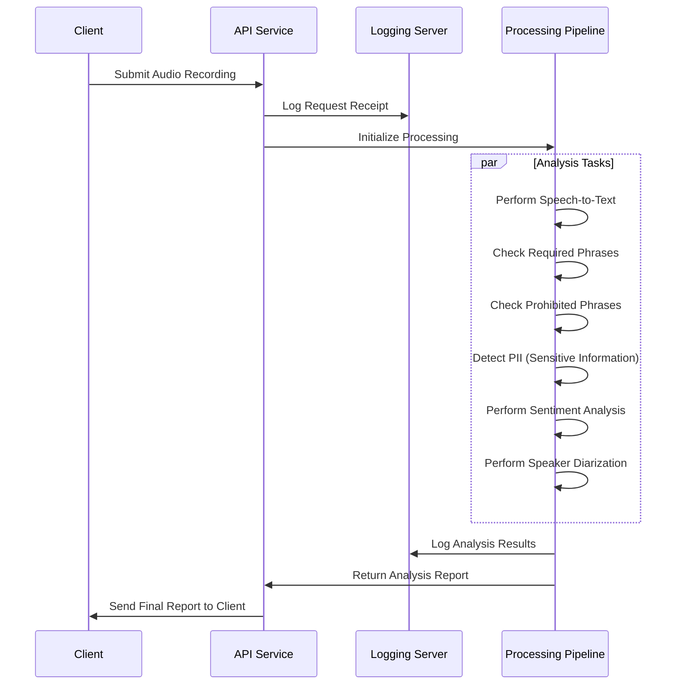

# Customer Service Agent Installation Guide and Overview

## Mermaid Diagrams




# How to Run the Project

### Prerequisites
1. Install Python 3.12
2. Install `just`
3. Install `uv` (package installer/environment manager)
4. Install ffmpeg 

```bash
# Install just 
sudo apt install just
```

```bash
# Install uv 
curl -LsSf https://astral.sh/uv/install.sh | sh
```

### Step 1: Setup Environment

```bash
# Setup environment and install all dependencies
just setup
```

This will:
- Set up your Python environment
- Install required dependencies

### Step 2: Configure Environment

Create a `.env` file in the project root with your Hugging Face token:

```
HF_TOKEN = "your HF token"
```

**Important:** Make sure to give access to the "pyannote/speaker-diarization-3.1" pretrained model on Hugging Face.

### Step 3: Start the Servers

You can start all servers at once with a single command:

```bash
# Start all servers (logging, backend, and frontend)
just start-all
```

This will start all servers in the background and save their output to respective log files:
- `logging_server.log`
- `backend_server.log`
- `frontend_server.log`

To stop all servers:
```bash
just stop-all
```

### Access Frontend
You can view you frontend at http://localhost:7860/

### mkdocs Documnetation
You can view your documentation at http://127.0.0.1:8000/


Alternatively, you can start each server individually in separate terminals:

```bash
# Start the Logging Server
just start-logging-server

# Start the FastAPI Application
just start-backend-server

# Start the Frontend Server
just start-frontend-server
```

### Step 4: Access the API

Open your browser and go to:
```
http://127.0.0.1:3000/docs
```

Use the Swagger UI to test the API endpoints.

### Step 5: Test Endpoints
- Upload an audio file to the `/analyze` endpoint for a complete analysis
- Use specialized endpoints for specific functionalities:
  - `/analyze` - all audio analysis, it includes all the endpoints
  - `/transcribe` - Audio transcription only
  - `/compliance` - Check for required phrases
  - `/profanity` - Detect and mask profanity
  - `/pii` - Check for profanity and sensitive information
  - `/mask_transcript` - Give masked transcription
  - `/sentiment_analysis`- Give sentiment analysis (positive , negative and neutral)
  - `/categorization`- give call category
  - `/diarization`- Measure customer-to-agent speaking ratio (agent should not dominate), detect excessive agent interruptions, and track time-to-first-token (TTFT) for agent responses

---

## How to Evaluate the Project

### 1. Test with Sample Audio Files
- Use sample customer service call recordings to test the system
- Verify accuracy of:
  - Transcription quality
  - Compliance phrase detection
  - PII and profanity masking
  - Sentiment analysis
  - Call categorization
  - diarization

### 2. Check Logs
- Verify logs are being sent to the logging server
- Review log files for errors, warnings, and debug information

### 3. Evaluate Performance
- Measure processing time for:
  - Transcription
  - Full analysis
- Assess accuracy of sentiment analysis and call categorization

### 4. Test Error Handling
- Upload invalid files (non-audio files) and verify error messages
- Check logs for proper exception handling


# Call Compliance Analyzer


## Project Overview

The **Call Compliance Analyzer** processes customer service call recordings to provide comprehensive insights through:

- **🔊 Transcription**: Converting audio to text using OpenAI's Whisper model
- **✅ Compliance Checks**: Detecting required greetings, closings, and disclaimers
- **🔒 Sensitive Information Detection**: Identifying and masking PII and profanity
- **😊 Sentiment Analysis**: Determining conversation tone and emotional context
- **🏷️ Call Categorization**: Classifying calls into meaningful business categories
- **⏱️ Diarization**: Measure customer-to-agent speaking ratio (agent should not dominate), detect excessive agent interruptions, and track time-to-first-token (TTFT) for agent responses.

Built with **FastAPI** for the backend, **Loguru** for logging, and **mkdocs-material** for documentation.

---

## Functionalities

### 1. Audio Transcription

- Converts audio files to text using OpenAI's Whisper model
- Supports multiple audio formats (`.wav`)
- Returns transcribed text with precise timestamps for each segment

### 2. Compliance Checks

Detects predefined phrases in calls:

| Category | Example Phrases |
|----------|----------------|
| **Greetings** | "Hello", "Thank you for calling" |
| **Closing Statements** | "Goodbye", "Have a great day" |
| **Disclaimers** | "Calls may be recorded", "Do not share sensitive information" |

Provides time markers for each detected phrase.

### 3. Sensitive Information Detection

- Detects and masks:
  - **PII**: Credit card numbers, email addresses, SSNs
  - **Profanity**: Offensive or inappropriate language
- Replaces sensitive information with `****`

### 4. Sentiment Analysis

- Analyzes call sentiment using Hugging Face's `sentiment-analysis` pipeline
- Returns:
  - Sentiment label (`POSITIVE`, `NEGATIVE`, `NEUTRAL`)
  - Confidence score

### 5. Call Categorization

Classifies calls into categories based on keywords:

| Category | Keywords |
|----------|----------|
| **Returns** | "Return", "Refund", "Exchange" |
| **Technical Support** | "Issue", "Error", "Fix" |
| **Billing** | "Bill", "Payment", "Invoice" |
| **General** | "Help", "Assist", "Support" |

### 6. Diarization

- Measure customer-to-agent speaking ratio
- detect excessive agent interruptions
- track time-to-first-token (TTFT) for agent responses.


# ✨ Experience and Learnings


## 🌟 What Worked Well

- **Centralized Logging**: Using Loguru with ZMQ for unified logging improved debugging
- **Modular Design**: Breaking the project into smaller components enhanced maintainability
- **FastAPI**: Provided excellent performance and ease of use for API development

## 🧩 Challenges

- **Transcription Accuracy**: Whisper occasionally struggled with low-quality audio or accents
- **PII Detection**: Balancing false positives and negatives in PII detection was challenging
- **Log Rotation**: Configuring log rotation and compression required careful setup
- **Logging and Debugging**: Initially, debugging errors was challenging due to insufficient logging. Adding detailed logs helped identify issues like mismatched transcript formats and improved the overall robustness of the tool.

## 💡 What I Learned

- **Modular design**: Breaking down complex tasks into smaller functions made the codebase easier to maintain and debug.
- **Logging Best Practices**: Effective use of Loguru for centralized logging and management
- **API Design**: Improved skills in designing intuitive RESTful APIs with FastAPI
- **Error Handling**: Better approaches to exception handling and error messaging

## 🔍 Project Difficulty

Overall, the project was **moderately challenging**. Integrating multiple libraries (e.g., Whisper, PyAnnote, Hugging Face Transformers) and ensuring compatibility between them required careful planning and testing. However, the effort paid off as the final tool is robust and provides valuable insights into customer-agent interactions, including compliance markers, sentiment analysis, and speaking behavior metrics.

---
