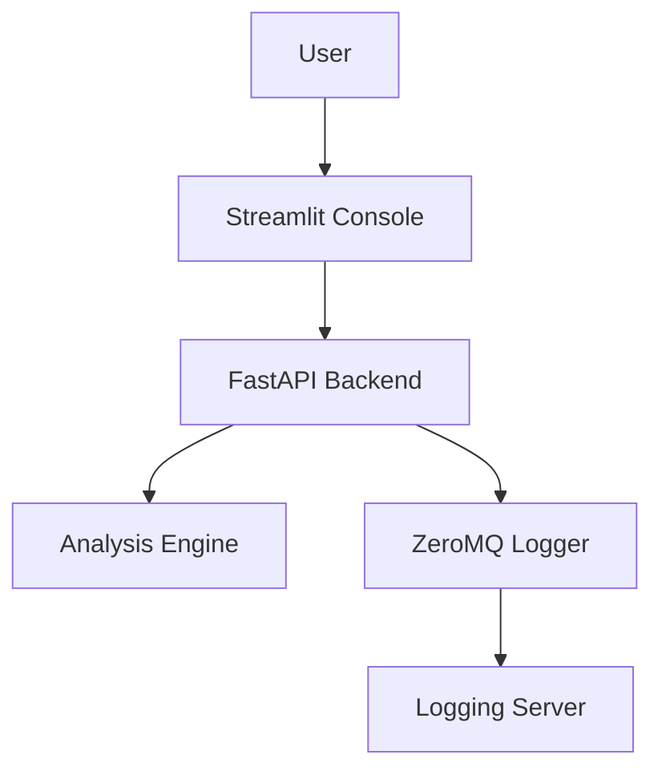

# Automated Customer Service Agent


A mission-critical intelligent service agent designed for zero-latency customer interaction and high-throughput data processing. This system integrates real-time ZeroMQ logging with advanced LLM-based query analysis and a responsive Streamlit console, making it ideal for enterprise-scale support automation.

## Table of Contents
- [Tech Stack & Architecture](#tech-stack--architecture)
- [Prerequisites](#prerequisites)
- [Installation & Local Setup](#installation--local-setup)
- [Usage & Running the App](#usage--running-the-app)
- [Testing](#testing)
- [Deployment](#deployment)
- [Contributing Guidelines](#contributing-guidelines)
- [License and Contact](#license-and-contact)

## Tech Stack & Architecture

### Core Technologies
- **Backend Orchestration**: `FastAPI` (Asynchronous event handling)
- **Real-Time Logging**: `ZeroMQ` (High-performance, distributed logging messaging)
- **Frontend Console**: `Streamlit` (Interactive agent dashboard)
- **Configuration Engine**: `Pydantic` (Validated settings and schema management)
- **Monitoring**: `mkdocs-material` (Integrated technical documentation)

### High-Level Architecture
The agent operates as a decoupled multi-component system:
- **`analyzer/`**: Core logic for parsing customer intents and processing high-velocity queries.
- **`zmq_logger.py`**: A specialized, distributed log aggregation server utilizing ZeroMQ for zero-bottleneck tracking.
- **`frontend.py`**: Streamlit-based web console for real-time interaction and performance metrics.
- **`start_server.py`**: Integrated entry point orchestrating backend and frontend services concurrently.


```mermaid
graph TD;
    User-->Frontend[Streamlit Console];
    Frontend-->FastAPI[FastAPI Backend];
    FastAPI-->Analyzer[Analysis Engine];
    FastAPI-->ZMQ[ZeroMQ Logger];
    ZMQ-->Logs[Logging Server];
```

## Prerequisites
- **Python**: v3.10+
- **API Access**: LLM API keys (if using remote providers like OpenAI or Gemini).
- **Network**: ZeroMQ default ports (e.g., 5555) must be accessible within the execution environment.

## Installation & Local Setup

```bash
git clone https://github.com/Devansh-Kesan/Customer-Service-Agent.git
cd Customer-Service-Agent
uv sync
```

### Environment Variables
Construct a `.env` file referencing your LLM provider and ports:
```bash
AGENT_MODE="production"
LOG_SERVER_URL="tcp://127.0.0.1:5555"
```

## Usage & Running the App

### Start the Integrated Console
Using the automated server bootstrapper:
```bash
uv run python start_server.py
```
This command concurrently initializes:
- The **FastAPI Service** (Default: `http://localhost:8000`)
- The **ZeroMQ Logger**
- The **Streamlit Frontend** (Default: `http://localhost:8501`)

## Testing
- **Validation**: Utilize scripts in `validate/` for regression testing of intent classifications.
- **Linter**: `uv run ruff check .`
- **Documentation**: `uv run mkdocs serve` (Launches the documentation site locally).

## Deployment
For production, utilize the contained `pyproject.toml` to build target virtual environments. We recommend deploying the FastAPI backend as an AWS ECS Fargate service and scaling the ZeroMQ loggers in dedicated sidecar containers for observability as defined in our `docs/`.

## Contributing Guidelines
1. Branch from `main`.
2. Adhere to **Trunk-based development**.
3. Submit **Conventional Commits**: `feat: add async sentiment analysis tool`.
4. All code must pass `ruff` validation for **ALL** rule categories.

## License and Contact
- **License**: MIT
- **Contact**: Devansh Kesan (https://github.com/Devansh-Kesan)
